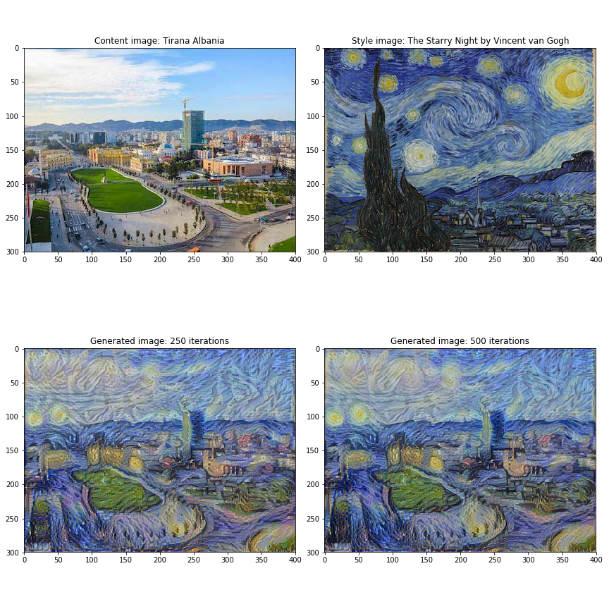
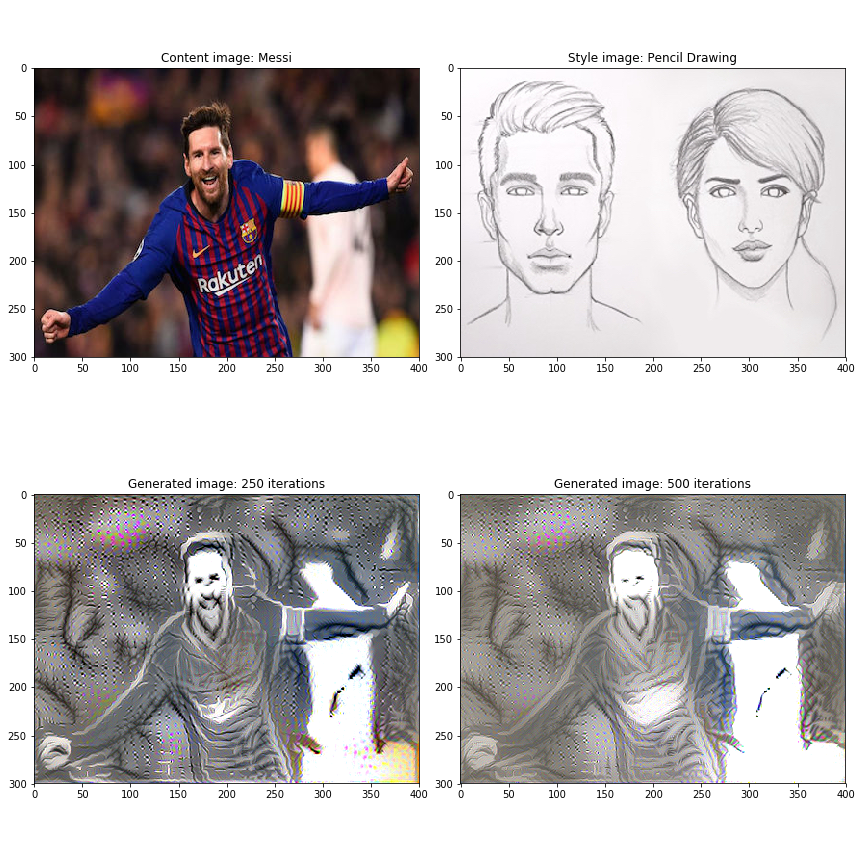

# Convolutional-Neural-Networks
Convolutional Neural Networks repository for all projects and programming assignments of Course 4 of 5 of the Deep Learning Specialization offered on Coursera and taught by Andrew Ng, covering topics such as convolutional neural networks and classical architectures like LeNet-5 (1998), AlexNet (2012), GoogleNet Inception Network (2014), VGG-16 (2015), ResNet (2015), 1x1 Convolutions (2014), OverFeat (2014), R-CNN (2014), Fast R-CNN (2015), Faster R-CNN (2016), YOLO (2016), YOLO9000 (2016), DeepFace (2014), FaceNet (2015) and Neural Style Transfer (2015) that propelled deep learning in new heights.

I loved implementing applications brining one step closer to safe autonomous driving, object detection, accurate face recognition and  automatic reading of radiology images. The highlight of this course was using neural style transfer to generate art, which as you can see below I had a wonderful time exploring using the Google Cloud Platform (GCP). Finally I learned how to apply these algorithms to a variety of image, video, and other 2D or 3D data using Keras and Tensorflow.

**Convolutional Neural Networks and Classical Architectures, see Papers**
* 1986 Backprop Learning representations by back-propagating errors - Rumelhart, Hinton, Williams
* 1998 LeNet-5 GradientBased Learning Applied to Document Recognition - LeCun, Bottou, Bengio, Hanner
* 2012 AlexNet ImageNet Classification with Deep Convolutional Neural Networks - Krizhevsky, Sutskever, Hinton
* 2014 GoogleNet Inception Network Going Deeper with Convolutions - Szegedy et al
* 2015 VGG-16 Very Deep Convolutional Networks for Large-Scale Image Recognition - Simonyan, Zisserman
* 2015 ResNet Deep Residual Learning for Image Recognition - He, Zhang, Ren, Sun
* 2014 1x1 Convolution Network In Network - Lin, Chen, Yan
* 2014 OverFeat Integrated Recognition, Localization and Detection using Convolutional Networks - Sermanet, Eigen, Zhang, Mathieu, Fergus, LeCun
* 2014 R-CNN Rich feature hierarchies for accurate object detection and semantic segmentation - Girshick, Donahue, Darrell, Malik
* 2015 Fast R-CNN - Girshick
* 2016 Faster R-CNN Towards Real-Time Object Detection with Region Proposal Networks - Ren, He, Girshick, Sun
* 2016 YOLO You Only Look Once - Unified, Real-Time Object Detection - Redmond, Divvala, Girshick, Farhadi
* 2016 YOLO9000 - Better, Faster, Stronger - Redmon, Farhadi
* 2013 Visualizing and Understanding Convolutional Networks - Zeiler, Fergus
* 2014 DeepFace- Closing the Gap to Human-Level Performance in Face Verification - Taigman, Yang, Ranzato, Wolf
* 2015 FaceNet- A Unified Embedding for Face Recognition and Clustering - Schroff, Kalenichenko, Philbin
* 2015 A Neural Algorithm of Artistic Style  - Gatsys, Ecker, Bethge

